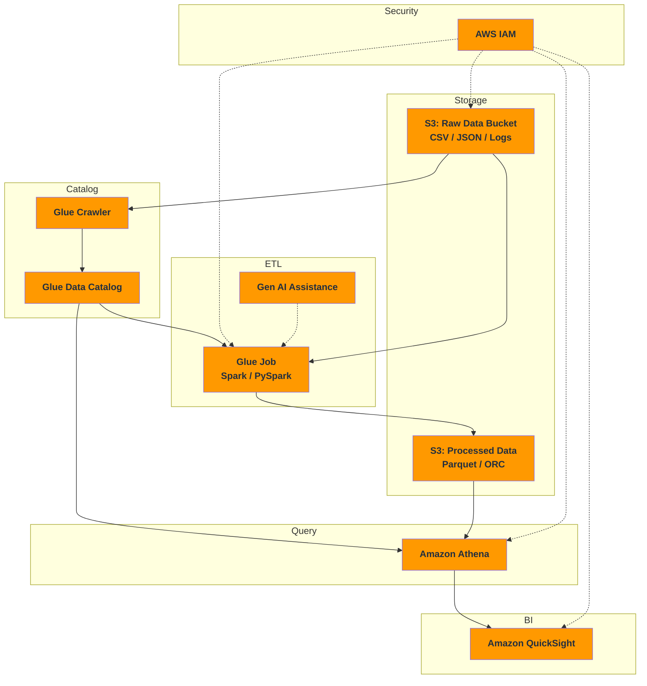

#review: DRAFT

# AWS Serverless Data Analytics Pipeline
### 01 — aws-serverless-data-analytics — synthesis

---

## Concept Map & Research Synthesis

### Synthesis Overview

The provided sources converge on a single coherent narrative: AWS offers a fully serverless, end-to-end data analytics pipeline spanning storage (S3), metadata management (Glue Data Catalog), transformation (Glue ETL jobs), querying (Athena), and visualization (QuickSight), secured by IAM. No significant conflicts or disagreements were found between sources, though the official AWS documentation emphasizes newer generative AI capabilities that community sources (2023–2024) do not yet cover.

**Sources fetched successfully (6 of 8):**
- AWS Glue product page (official)
- AWS IAM product page (official)
- Amazon QuickSight product page (official)
- AWS Glue Best Practices — Prescriptive Guidance (official)
- "Data Analysis Made Easy" — Ifeanyiobiana (Medium)
- "Getting Started with AWS Glue" — Zoumana Keita (DataCamp)

**Sources unavailable (2):**
- Classcentral course listing (403)
- "My Top 10 Tips for Working with AWS Glue" — Medium/SWLH (403)

### a. Structured Outline — Concept Map

```
AWS SERVERLESS DATA ANALYTICS PIPELINE
│
├── 1. Storage Layer — Amazon S3
│   ├── Scalable object storage for raw and processed data
│   ├── Input (CSV, JSON, logs) and output (Parquet, ORC) buckets
│   ├── Partitioning strategy critical for query performance
│   └── Lifecycle policies for cost management
│
├── 2. Catalog and Discovery — AWS Glue Data Catalog
│   ├── Central metadata repository (schemas, tables, partitions)
│   ├── Glue Crawlers — auto-discover schema from S3 data sources
│   ├── Classifiers for custom data formats
│   └── Populated catalog consumed by Athena, Redshift Spectrum, EMR
│
├── 3. ETL and Transformation — AWS Glue Jobs
│   ├── Serverless, Spark-based ETL engine
│   ├── Job types: Spark (standard), Streaming, Python Shell
│   ├── Code in PySpark or Scala (manual or auto-generated)
│   ├── Best practices:
│   │   ├── Develop locally first using Docker
│   │   ├── Use interactive sessions for iterative development
│   │   ├── Partition data to reduce scan volume
│   │   ├── Optimize memory (grouping, join optimizations, S3 list)
│   │   ├── Output columnar formats (Parquet, ORC)
│   │   └── Scale horizontally vs vertically based on workload type
│   └── Generative AI assistance for code modernization and troubleshooting
│
├── 4. Query Layer — Amazon Athena
│   ├── Serverless, standard SQL queries against data in S3
│   ├── Reads schema from Glue Data Catalog
│   ├── Pay-per-query pricing — no cluster to manage
│   └── Performance optimized by partitioning, columnar formats, and
│       partition projection
│
├── 5. Visualization and BI — Amazon QuickSight
│   ├── AI-powered business intelligence service
│   ├── Natural language querying ("Ask Q")
│   ├── Embedded analytics, dashboards, and scheduled reports
│   ├── SPICE in-memory engine for fast performance
│   └── Integrates with Athena, S3, RDS, Redshift, and 40+ sources
│
└── 6. Security (Cross-Cutting) — AWS IAM
    ├── Fine-grained access control (users, groups, roles, policies)
    ├── Least privilege principle — grant only what is needed
    ├── IAM roles (not long-lived users) for service-to-service auth
    ├── Temporary security credentials
    ├── IAM Access Analyzer for policy refinement
    └── IAM Identity Center for multi-account workforce access
```

### b. Visual Diagram



---

## Key Insights

1. **The Glue Data Catalog is the central integration point.** Every source agrees that the Data Catalog (populated by crawlers) is what connects S3 data to Athena, Glue jobs, and Redshift Spectrum. Without it, the pipeline has no shared metadata layer.

2. **Columnar formats are non-negotiable for production pipelines.** Every source covering performance emphasizes that outputting to Parquet or ORC dramatically reduces scan volume, speeds up queries, and lowers Athena costs.

3. **IAM roles, not users, are the correct access pattern for service-to-service auth.** Multiple sources demonstrate that Glue, Athena, and QuickSight assume IAM roles with scoped policies rather than using long-lived user credentials.

4. **There are significant gaps in the provided sources around orchestration, data quality, and cost governance.** None of the available sources cover how to schedule multi-job pipelines with dependencies (Step Functions, EventBridge), implement data quality checks, or monitor costs across the end-to-end pipeline.

5. **Community sources lag behind official documentation on newer capabilities.** The official AWS Glue page highlights generative AI for ETL code generation and Spark troubleshooting (released 2024+), but the community blog and tutorial sources from 2023-2024 do not reference these features at all.

---

## Suggested Topic List

**Proposed Topic:** AWS Serverless Data Analytics Pipeline
**Suggested Format:** 5-day bootcamp or 10-module training

| Day | Topic | Covered in Sources? |
|-----|-------|---------------------|
| 1 | Cloud Foundations and AWS Account Setup | [GAP] — not covered |
| 2 | Amazon S3 for Data Lakes (buckets, partitioning, lifecycle) | Partially covered |
| 3 | AWS Glue: Crawlers, Data Catalog, and Schema Discovery | Well covered |
| 4 | AWS Glue: ETL Jobs with Spark and PySpark | Well covered |
| 5 | Amazon Athena: Serverless SQL Querying | Partially covered |
| 6 | Amazon QuickSight: Dashboards and BI Visualization | Well covered |
| 7 | IAM Deep Dive for Analytics Pipelines | Partially covered |
| 8 | Orchestration and Automation (Glue Triggers, Step Functions, EventBridge) | [GAP] — not covered |
| 9 | Data Quality, Monitoring, and Alerting (CloudWatch, Glue Data Quality) | [GAP] — not covered |
| 10 | Cost Optimization and Governance for Serverless Analytics | [GAP] — not covered |

---

*Version: v1.0 | Created: 2026-05-30 | Author: Research Synthesizer*
