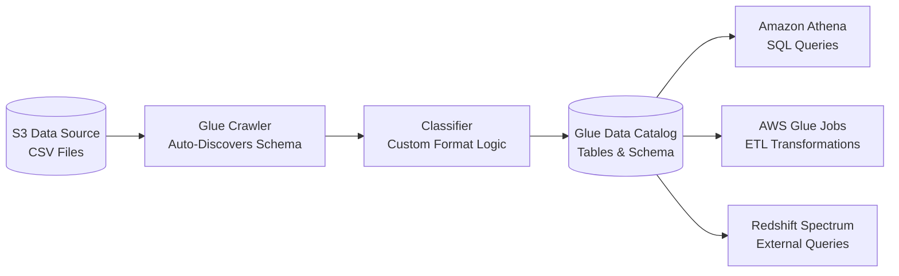
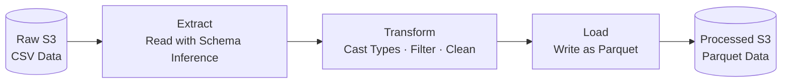
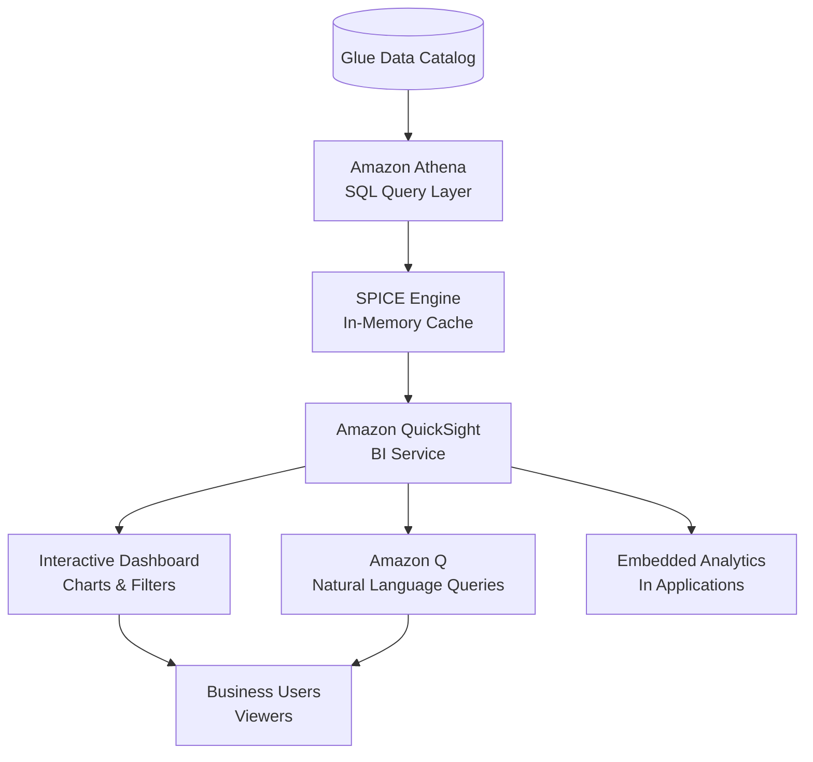
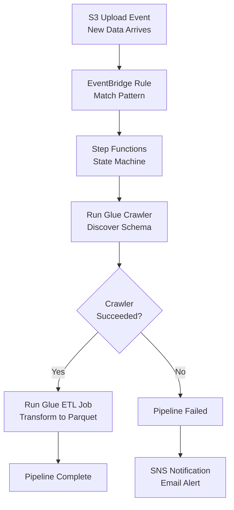
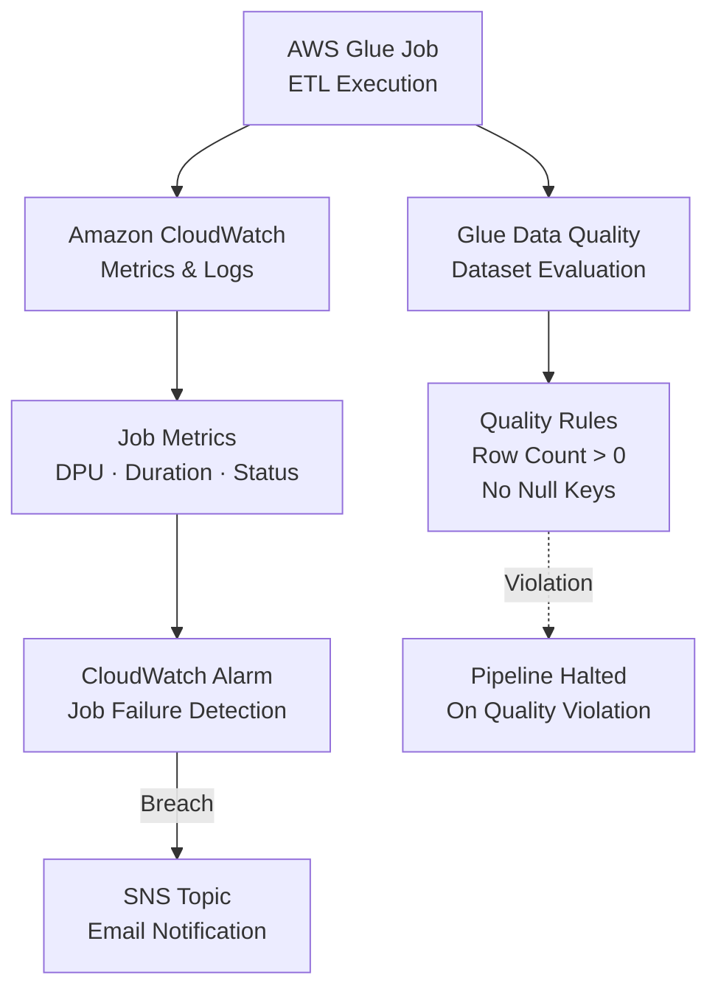

#review: DRAFT

# AWS Serverless Data Analytics Pipeline
### 04 — aws-serverless-data-analytics — Visual Generator

---

## Visuals

### Day 3: AWS Glue: Crawlers, Data Catalog & Schema Discovery

**Recommended diagram type:** Flowchart
**Reason:** A flowchart best captures the linear, step-by-step process of data flowing from S3 through the crawler into the Data Catalog, and then being consumed by downstream services.

> This flowchart traces the data discovery process: a Glue crawler scans CSV files in S3, optionally applies a classifier for custom formats, and populates the Glue Data Catalog with table definitions. Once catalogued, the metadata is immediately available to Athena, Glue Jobs, and Redshift Spectrum.

---

### Day 4: AWS Glue: ETL Jobs with Spark & PySpark

**Recommended diagram type:** Flowchart
**Reason:** A flowchart best represents the sequential ETL stages — extract, transform, load — which is inherently a linear data processing pipeline.

> This flowchart illustrates the three stages of an AWS Glue ETL job: extract (reading CSV from S3 with automatic schema inference), transform (casting columns to correct types, filtering null rows), and load (writing the cleaned data as compressed Parquet back to S3).

---

### Day 6: Amazon QuickSight: Dashboards & BI

**Recommended diagram type:** Architecture Diagram
**Reason:** An architecture diagram best shows how QuickSight connects to upstream data sources, caches data in SPICE, and serves visualisations to end users.

> This architecture diagram illustrates how Amazon QuickSight connects to the analytics pipeline. Athena queries the Glue Data Catalog, results are cached in the SPICE in-memory engine for fast performance, and QuickSight renders interactive dashboards and natural-language query capabilities for business users.

---

### Day 8: Orchestration & Automation

**Recommended diagram type:** Flowchart
**Reason:** A flowchart best captures the branching logic, sequential steps, and error handling path of a Step Functions state machine.

> This flowchart represents an automated Step Functions workflow triggered by an S3 upload event via EventBridge. The state machine runs a Glue crawler, checks for success, proceeds to an ETL job only if the crawler succeeded, and sends an SNS alert on failure — turning a manual sequence into an automated, resilient pipeline.

---

### Day 9: Data Quality, Monitoring & Alerting

**Recommended diagram type:** Architecture Diagram
**Reason:** An architecture diagram best shows how Glue jobs, CloudWatch metrics, alarms, and data quality rules interact as a monitoring ecosystem.

> This architecture diagram shows the monitoring and data quality setup for the pipeline. Glue jobs emit metrics to CloudWatch, which triggers alarms that notify operators via SNS when jobs fail. Glue Data Quality evaluates output datasets against rules and automatically halts the pipeline if quality checks are violated.

---

*Version: v1.0 | Created: 2026-05-30 | Author: Instructional Designer*
