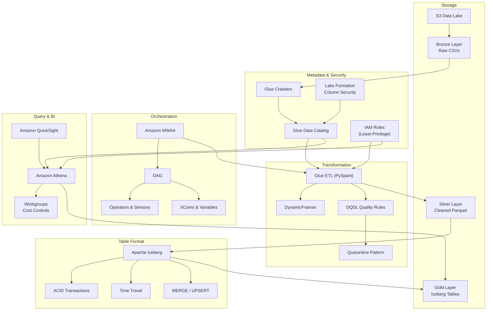

#review: DRAFT

# AWS Glue, Athena & Airflow — Serverless Data Analytics Pipeline
### 01 — glue-athena-airflow — Research Synthesizer

---

## Concept Map & Research Synthesis

### Structured Outline

```
AWS Serverless Data Analytics Pipeline
├── Storage Layer (S3)
│   ├── Medallion Architecture
│   │   ├── Bronze — raw ingested data (CSV)
│   │   ├── Silver — cleaned, validated Parquet
│   │   └── Gold — aggregated Iceberg tables
│   └── Partitioning & Compression
│       ├── Hive-style partitioning (year=YYYY/month=MM)
│       └── Parquet with Snappy/ZSTD
│
├── Metadata & Security
│   ├── Glue Data Catalog
│   │   ├── Crawlers — automatic schema discovery
│   │   ├── Partition detection from S3 folder structure
│   │   └── Custom Classifiers for schema hints
│   ├── Lake Formation
│   │   ├── Column-level security
│   │   ├── Row-level filters
│   │   └── Centralized permission management
│   └── IAM Least-Privilege [GAP]
│       ├── Separate roles per service
│       └── Scoped inline policies
│
├── Data Transformation (Glue ETL)
│   ├── PySpark Fundamentals
│   │   ├── DynamicFrames — schema-on-read, choice types
│   │   └── DataFrames — fixed schema, Spark SQL
│   ├── Data Quality (DQDL)
│   │   ├── Declarative rules (IsComplete, IsUnique, CustomSql)
│   │   └── EvaluateDataQuality transform
│   ├── Quarantine Pattern
│   │   ├── Dead Letter S3 prefix for failing records
│   │   └── Metadata columns (dq_failed_rules, dq_timestamp)
│   └── Performance
│       ├── Grouping small files
│       └── Worker type / DPU sizing
│
├── Table Format
│   └── Apache Iceberg
│       ├── ACID transactions
│       ├── Snapshot-based time travel
│       ├── Schema evolution
│       ├── MERGE / UPSERT (row-level)
│       └── Hidden partitioning
│
├── Orchestration (MWAA / Airflow)
│   ├── Core Concepts
│   │   ├── DAG — pipeline blueprint
│   │   ├── Operators — execute work (GlueJobOperator, AthenaOperator)
│   │   └── Sensors — wait for conditions (S3KeySensor)
│   ├── MWAA Management
│   │   ├── requirements.txt for dependencies
│   │   ├── plugins.zip for custom plugins
│   │   └── S3 DAG sync
│   ├── Advanced DAG Features
│   │   ├── XComs — cross-task data passing
│   │   ├── Variables — environment config
│   │   └── Retries & Callbacks — error handling, alerts
│   └── Monitoring
│       └── Airflow UI — task status, logs, grid view
│
├── Query & Analytics (Athena)
│   ├── Workgroups
│   │   ├── Per-query data scan limits
│   │   ├── Query isolation between teams
│   │   └── CloudWatch cost metrics
│   ├── Iceberg DML
│   │   ├── MERGE INTO (upsert)
│   │   ├── UPDATE / DELETE
│   │   └── Time travel queries
│   └── Data Dictionary
│       └── Glue Catalog column comments
│
└── Visualization (QuickSight)
    ├── KPI dashboards
    ├── Line charts, pie charts
    └── Data Health gauge
```

### Visual Diagram



---

## Key Insights

1. **Medallion Architecture is the organizing principle.** The Bronze/Silver/Gold layering is not just a folder convention — it enforces a separation of concerns where each layer has distinct quality guarantees and access patterns. Raw data never leaves Bronze, transformed data lives in Silver, and only business-ready aggregates reach Gold.

2. **DQDL replaces custom validation code.** Declarative data quality rules eliminate hundreds of lines of Python for null checks, uniqueness constraints, and range validations. Rules are standardized, readable by analysts and engineers, and integrated directly into Glue's `EvaluateDataQuality` transform.

3. **The Quarantine Pattern prevents silent data loss.** Failing quality checks does not mean dropping records. Routing bad data to a Dead Letter S3 prefix with metadata columns (failed rules, timestamp, source path) creates an auditable trail and enables reprocessing after root cause correction.

4. **Apache Iceberg transforms S3 into a transactional store.** Without Iceberg, data lakes lack ACID transactions, row-level updates, and schema evolution. Iceberg's metadata layer adds these capabilities, making Athena a write-capable engine through `MERGE INTO`, `UPDATE`, and time travel queries.

5. **Lake Formation fills the gap IAM cannot reach.** IAM policies control service-level access but cannot restrict specific columns or rows within a table. Lake Formation provides column-level and row-level security enforced at the query engine, essential for PII protection and compliance.

6. **Airflow orchestration is the glue between services.** A single DAG chains S3 sensors, Glue job triggers, and Athena queries into an automated, scheduled pipeline. XComs pass runtime metadata (like JobRunId) between tasks, and retries with callbacks handle the inevitable failures.

7. **Cost control requires explicit boundaries.** Athena Workgroups with per-query data scan caps prevent runaway queries from incurring unexpected costs. Combined with S3 partitioning and columnar compression, these controls keep analytics affordable at scale.

---

## Suggested Topic List

| Day | Topics | Phase | Tag |
|-----|--------|-------|-----|
| Day 1 | S3 Storage & Medallion Architecture (Bronze/Silver/Gold) | Storage | — |
| Day 2 | AWS Glue Data Catalog & Crawlers | Catalog & Security | — |
| Day 3 | AWS Lake Formation & Column-Level Security | Catalog & Security | — |
| Day 4 | Apache Iceberg — ACID Transactions on the Data Lake | Storage | — |
| Day 5 | Hands-on: S3 Environment & Lake Formation Setup | Catalog & Security | — |
| Day 6 | Glue PySpark — DynamicFrames vs DataFrames | ETL & Quality | — |
| Day 7 | DQDL — Declarative Data Quality Rules | ETL & Quality | — |
| Day 8 | Quarantine Pattern & Bad Data Handling | ETL & Quality | — |
| Day 9 | Performance Tuning — Partitioning, Compression & Grouping | ETL & Quality | — |
| Day 10 | Hands-on: Glue ETL Job with Data Quality | ETL & Quality | — |
| Day 11 | Airflow Concepts — DAGs, Operators, Sensors | Orchestration | — |
| Day 12 | Amazon MWAA Environment Setup & Dependencies | Orchestration | — |
| Day 13 | Advanced DAGs — XComs, Variables, Error Handling | Orchestration | — |
| Day 14 | Hands-on: Building an MWAA DAG | Orchestration | — |
| Day 15 | IAM Roles & Least-Privilege Policies for Glue/Athena | Catalog & Security | [GAP] |
| Day 16 | Athena Workgroups & Cost Management | Analytics & Governance | — |
| Day 17 | SQL for Iceberg — MERGE, UPDATE, Time Travel | Analytics & Governance | — |
| Day 18 | QuickSight Dashboards & Data Dictionary | Analytics & Governance | — |
| Day 19 | Capstone — Part 1 (Storage, Catalog & ETL) | Capstone | — |
| Day 20 | Capstone — Part 2 (Orchestration, Dashboard & Final Testing) | Capstone | — |

**Phase distribution:** Storage (2), Catalog & Security (4), ETL & Quality (5), Orchestration (4), Analytics & Governance (3), Capstone (2)

**Gaps identified:** IAM Least-Privilege Policies — not explicitly covered in the provided sources; extends beyond the course outline for production security hardening.

---

*Version: v1.0 | Created: 2026-06-01 | Author: Research & Learning Assistant*

---

Synthesis complete. Please review the concept map, key insights, and suggested topic list. Confirm, adjust, or add topics before proceeding to Skill 2: Learning Path Architect.
