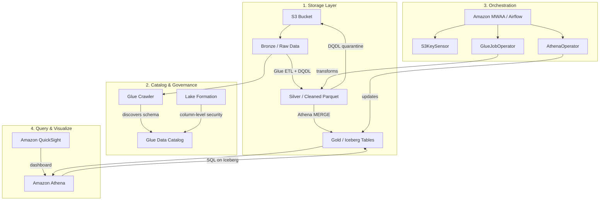

#review: APPROVED

# AWS Glue, Athena & Airflow — Serverless Data Analytics
### 01 — glue-athena-airflow — Research Synthesis

---

## Concept Map & Research Synthesis

### Structured Outline

```
AWS SERVERLESS DATA ANALYTICS PIPELINE
│
├── 1. STORAGE FOUNDATION (S3 + Medallion Architecture)
│   ├── Bronze Layer — raw ingested data (CSV, JSON)
│   ├── Silver Layer — cleaned, quality-checked data (Parquet)
│   ├── Gold Layer — business-ready, aggregated data (Apache Iceberg)
│   └── Partitioning & Compression strategies
│
├── 2. DATA CATALOG & GOVERNANCE
│   ├── AWS Glue Data Catalog — central metadata repository
│   ├── AWS Glue Crawlers — schema discovery and catalog population
│   ├── AWS Lake Formation — fine-grained access control, column-level security
│   └── Apache Iceberg — ACID transactions, schema evolution, time travel
│
├── 3. DATA TRANSFORMATION & QUALITY (Glue ETL)
│   ├── AWS Glue PySpark — serverless Spark execution
│   │   ├── DynamicFrames vs DataFrames
│   │   └── Grouping for small-file optimization
│   ├── DQDL (Data Quality Definition Language)
│   │   └── Declarative quality rules (e.g., payment_value > 0)
│   └── Quarantine Pattern — routing bad records to Dead Letter S3 prefix
│
├── 4. ORCHESTRATION (Amazon MWAA / Airflow)
│   ├── Core Concepts
│   │   ├── DAG — pipeline blueprint
│   │   ├── Operators — task executors (GlueJobOperator, AthenaOperator)
│   │   └── Sensors — condition waiters (S3KeySensor)
│   ├── MWAA Environment
│   │   ├── requirements.txt for dependencies
│   │   └── Plugins
│   ├── Advanced Patterns
│   │   ├── XComs — cross-task data passing
│   │   ├── Variables — environment config
│   │   └── Error Handling — retries, callbacks, alerts
│   └── Pipeline Flow: Sensor → Glue Job → Athena Query
│
├── 5. QUERYING & MANAGEMENT (Amazon Athena)
│   ├── SQL on Iceberg — MERGE, UPDATE, Time Travel
│   ├── Athena Workgroups — cost control, query limits
│   └── Athena as Management Tool — catalog auditing, schema verification
│
├── 6. VISUALIZATION (Amazon QuickSight)
│   ├── Dataset connection to Athena / Iceberg
│   ├── KPI Banners — Total Revenue, Late Delivery Rate
│   ├── Charts — Daily Revenue Trend, Order Status Breakdown
│   └── Data Health Dashboard — quality pass rate, storage volume
│
└── 7. DATA DOCUMENTATION & BEST PRACTICES
    ├── Data Dictionary — business-to-technical schema translation
    ├── Glue Table Comments — metadata enrichment
    ├── Iceberg Compaction — periodic small-file merging
    └── Source of Truth — Athena as audit layer
```

---

### Visual Diagram



---

### Key Insights

1. The Medallion Architecture (Bronze → Silver → Gold) provides a structured data lifecycle that separates raw ingestion from clean, business-ready datasets, enabling incremental quality enforcement at each layer.

2. AWS Glue Data Quality (DQDL) allows data engineers to define quality rules declaratively rather than writing custom validation code, reducing ETL maintenance overhead while ensuring consistency.

3. The Quarantine Pattern — routing failed records to a Dead Letter S3 prefix instead of dropping them — is a critical production practice that preserves data for audit and reprocessing without polluting downstream tables.

4. Apache Iceberg transforms Athena from a read-only query engine into a full data management layer by supporting ACID transactions, row-level upserts (MERGE), and time travel queries directly through SQL.

5. Amazon MWAA orchestration connects all pipeline stages through a single DAG, using Sensors to wait for conditions, Operators to execute work, and XComs to pass state between tasks — creating an end-to-end automated workflow.

6. Athena Workgroups serve as the primary cost-control mechanism, allowing administrators to enforce per-query data scan limits and isolate query environments between teams (e.g., engineering vs. analytics).

7. A Data Dictionary documented in the Glue Catalog (via table comments and column descriptions) acts as the translation layer between technical schemas and business terminology, directly impacting dataset discoverability and trust.

---

### Suggested Topic List

**Target Audience:** Junior Data Engineers

**Prerequisites:** SQL foundations (DDL), basic AWS knowledge (IAM, S3), familiarity with Python

| Day / Module | Topic | Notes |
|---|---|---|
| Module 1 | S3 Storage & The Medallion Architecture | Foundational |
| Module 2 | AWS Glue Data Catalog & Crawlers | Foundational |
| Module 3 | AWS Lake Formation & Column-Level Security | Foundational |
| Module 4 | Apache Iceberg — ACID Transactions on the Data Lake | Foundational |
| Module 5 | AWS Glue PySpark — DynamicFrames vs DataFrames | Core ETL |
| Module 6 | DQDL — Declarative Data Quality Rules | Core ETL |
| Module 7 | Quarantine Pattern & Bad Data Handling | Core ETL |
| Module 8 | Performance Tuning — Partitioning, Compression, Grouping | Optimization |
| Module 9 | Airflow Concepts — DAGs, Operators, Sensors | Orchestration |
| Module 10 | Amazon MWAA Environment Setup & Dependencies | Orchestration |
| Module 11 | Advanced DAGs — XComs, Variables, Error Handling | Orchestration |
| Module 12 | Athena Workgroups & Cost Management | Query & Manage |
| Module 13 | SQL for Iceberg — MERGE, UPDATE, Time Travel | Query & Manage |
| Module 14 | Amazon QuickSight Dashboards & KPIs | Visualization |
| Module 15 | Data Dictionary & Metadata Best Practices | Governance |
| Module 16 | [GAP] IAM Roles & Least-Privilege Policies for Glue/Athena | Security — mentioned but not detailed in sources |
| Module 17 | [GAP] Glue Job Bookmarking & Incremental Processing | Advanced ETL — not covered in sources |
| Module 18 | Capstone — Governed Data Lake for E-Commerce | Integration project |

---

*Version: v1.0 | Created: 2026-06-01 | Author: Research & Learning Assistant*

---

Synthesis complete. Please review the concept map, key insights, and suggested topic list. Confirm, adjust, or add topics before proceeding to Skill 2: Learning Path Architect.
