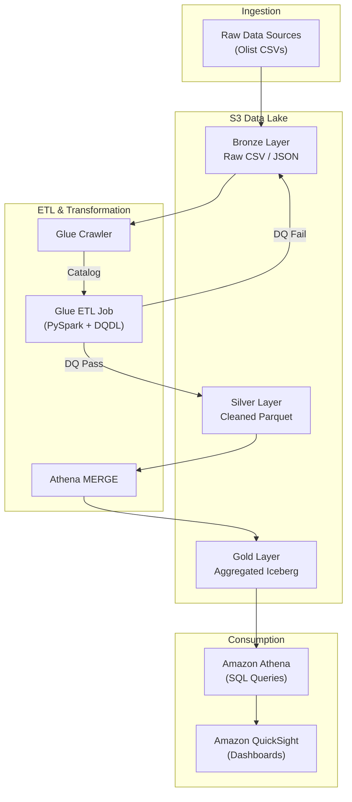
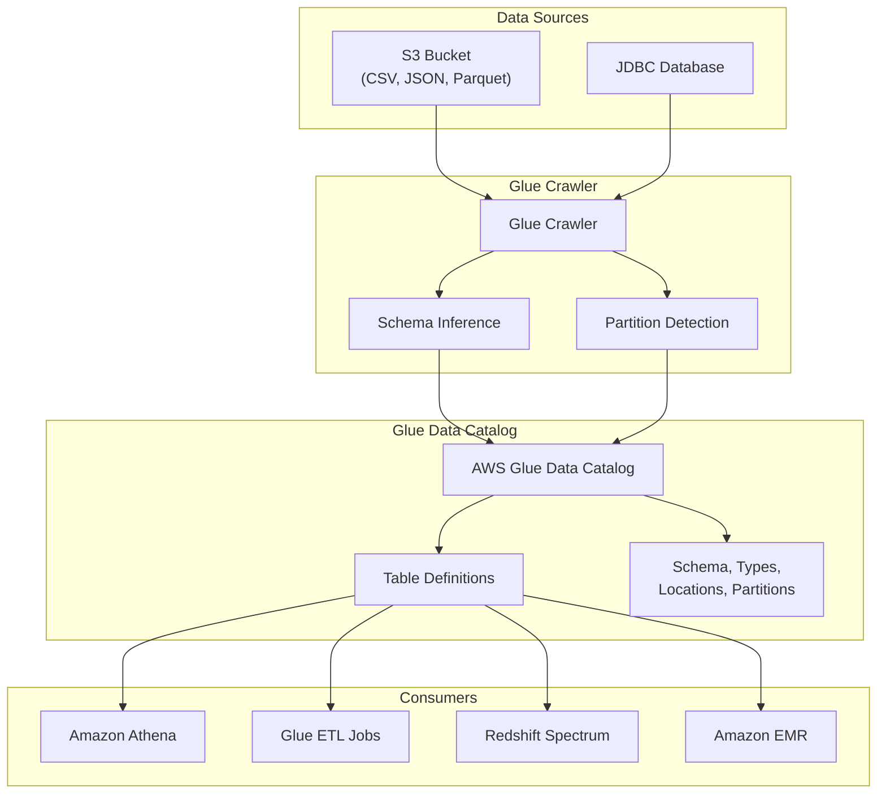
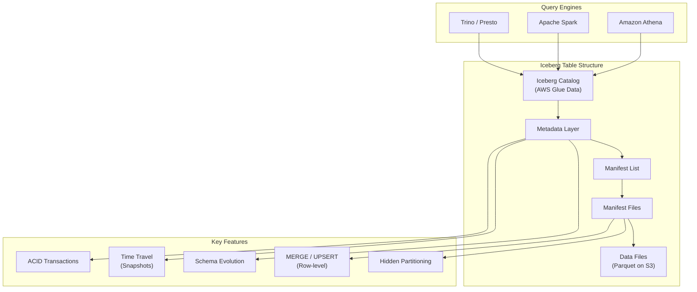
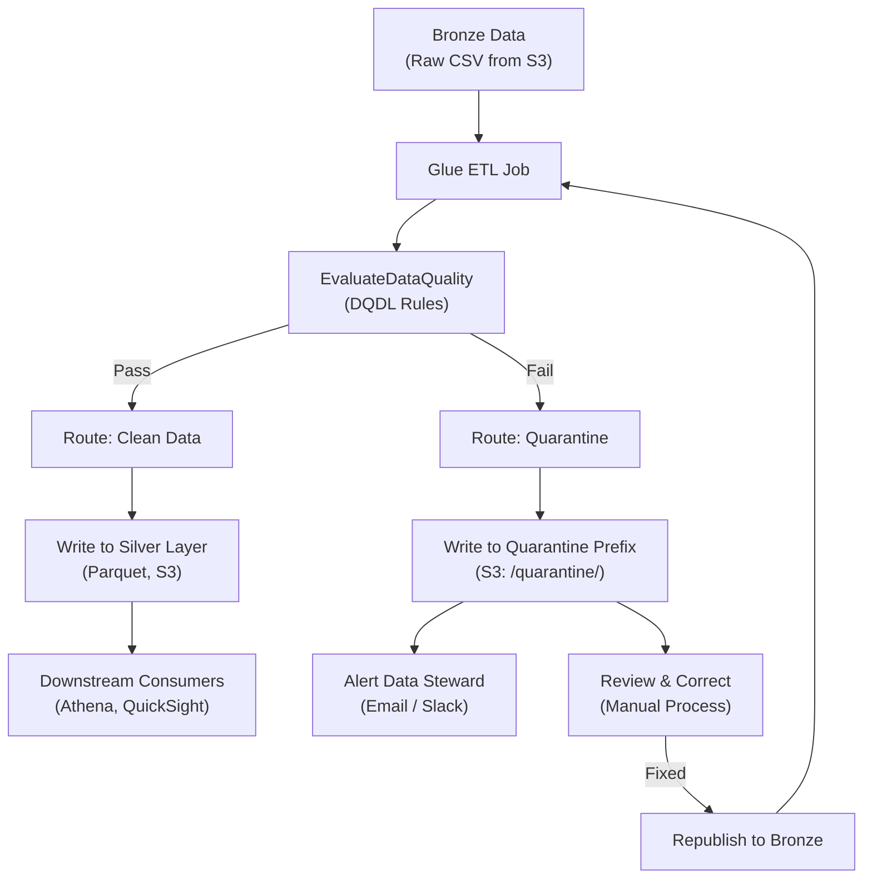
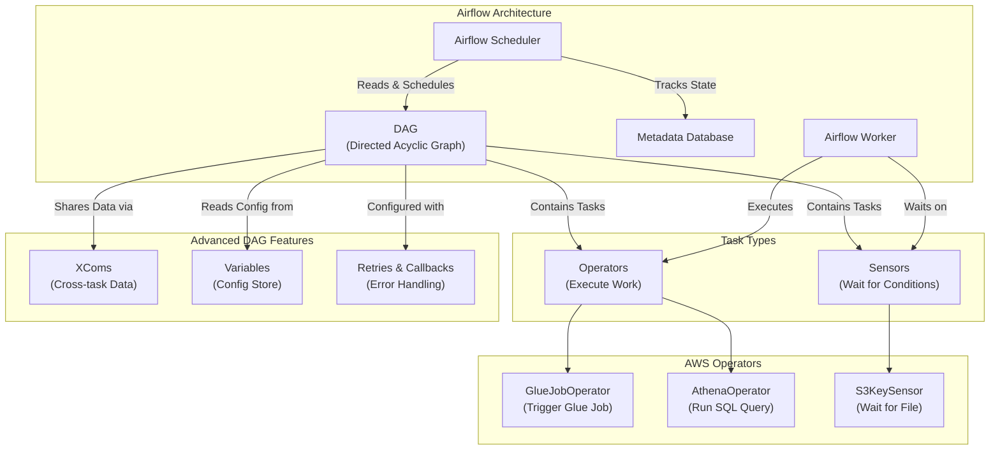

#review: APPROVED

# AWS Glue, Athena & Airflow — Serverless Data Analytics Pipeline
### 04 — glue-athena-airflow — Visual Generator

---

## Visuals

---

### Day 1: S3 Storage & The Medallion Architecture

**Recommended diagram type:** Architecture Diagram
**Reason:** An architecture diagram best shows the three storage layers (Bronze/Silver/Gold) and how data flows between them with the associated AWS services.

**Mermaid Code Block**

**Caption / Alt-text:**
This diagram illustrates the Medallion Architecture on AWS. Raw data is ingested into the Bronze layer, then cleaned and quality-checked by Glue ETL (passing to Silver, failing to quarantine). Silver data is aggregated into Gold Iceberg tables via Athena MERGE, and finally queried by Athena and visualized in QuickSight.

---

### Day 2: AWS Glue Data Catalog & Crawlers

**Recommended diagram type:** Architecture / Flowchart
**Reason:** The diagram must show both the process flow (crawler scanning data → inferring schema → populating the catalog) and the architecture (which services consume the catalog), making a combined architecture-flowchart the best fit.

**Mermaid Code Block**

**Caption / Alt-text:**
This diagram shows how a Glue Crawler connects to data sources (S3, JDBC), infers schemas and detects partitions, and populates the Glue Data Catalog. Multiple AWS analytics services — Athena, Glue ETL, Redshift Spectrum, and EMR — consume the catalog as their metadata source for querying and transforming data.

---

### Day 4: Apache Iceberg — ACID Transactions on the Data Lake

**Recommended diagram type:** Concept Map
**Reason:** Iceberg's architecture is a layered metadata structure where each level serves a distinct purpose. A concept map best shows the hierarchical relationship between the catalog, metadata layer, manifest lists, manifests, and data files, alongside the features each layer enables.

**Mermaid Code Block**

**Caption / Alt-text:**
This concept map shows Apache Iceberg's layered metadata architecture. The catalog points to the current metadata layer, which references manifest lists and manifest files that track which data files belong to each snapshot. Key features — ACID transactions, time travel, schema evolution, row-level upserts, and hidden partitioning — are enabled by this metadata layer. Multiple query engines (Athena, Spark, Trino) can read the same Iceberg table simultaneously.

---

### Day 8: Quarantine Pattern & Bad Data Handling

**Recommended diagram type:** Flowchart
**Reason:** The quarantine pattern is inherently a decision process — data passes or fails quality checks, and each outcome follows a different path. A flowchart is the most natural and readable way to represent this branching logic.

**Mermaid Code Block**

**Caption / Alt-text:**
This flowchart illustrates the Quarantine Pattern in Glue ETL. Data from Bronze is evaluated against DQDL rules. Passing records flow to the Silver layer for downstream consumption. Failing records are written to a quarantine S3 prefix, trigger an alert to a data steward, and can be reviewed, corrected, and republished back to Bronze for reprocessing.

---

### Day 11: Airflow Concepts — DAGs, Operators, Sensors

**Recommended diagram type:** Concept Map
**Reason:** Airflow has multiple interconnected abstractions (DAGs, Operators, Sensors, Scheduler, XComs) with clear relationships between them. A concept map best captures how these components relate and depend on each other within the Airflow ecosystem.

**Mermaid Code Block**

**Caption / Alt-text:**
This concept map shows the core Apache Airflow architecture. The Scheduler reads DAG definitions, tracks task states in the Metadata Database, and assigns work to Workers. A DAG contains Sensors (which wait for conditions like files landing in S3) and Operators (which execute work like triggering Glue jobs or running Athena queries). Advanced features — XComs, Variables, and Retries — add cross-task communication, configuration management, and error handling.

---

## Output Summary

| Day | Topic | Diagram Type | Status |
|-----|-------|-------------|--------|
| Day 1 | Medallion Architecture | Architecture Diagram | ✅ Generated |
| Day 2 | Glue Data Catalog & Crawlers | Architecture / Flowchart | ✅ Generated |
| Day 4 | Apache Iceberg | Concept Map | ✅ Generated |
| Day 8 | Quarantine Pattern | Flowchart | ✅ Generated |
| Day 11 | Airflow Concepts | Concept Map | ✅ Generated |

---

*Version: v1.0 | Created: 2026-06-01 | Author: Instructional Designer*

---

Visual complete. Copy the Mermaid code blocks into the relevant modules in the learning path document. Proceed to Skill 5: Quiz Generator when ready.
