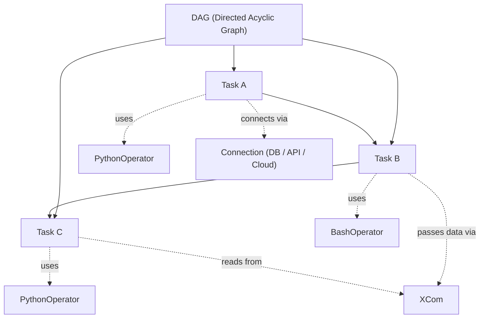

# Skill 4: Visual Generator

> **When to use this:** Use this skill for any module flagged as [VISUAL RECOMMENDED] after Skill 3 is complete. Trigger once per flagged module. This skill always recommends before it builds — nothing is generated without confirmation.

---

## How to Trigger This Skill

Copy the prompt below and paste it into your Research & Learning Hub project. Provide the module name, the visual description placeholder from Skill 3, and the full module content for context.

---

## The Prompt

```
SKILL: Visual Generator

Module: Day [X] — [TOPIC NAME]

Visual description from Skill 3:
[PASTE THE VISUAL DESCRIPTION LINE FROM THE MODULE'S VISUAL PENDING PLACEHOLDER]

Full module content for context:
[PASTE THE FULL DAY'S CONTENT FROM SKILL 3 OUTPUT]

---

Instructions:

1. ANALYZE the concept and the visual description provided.

2. RECOMMEND the most appropriate diagram type for this concept.
   Choose from the following and explain why it fits:

   - Flowchart — best for processes, decision trees, step-by-step flows
   - Sequence Diagram — best for interactions between systems or components over time
   - Concept Map — best for showing relationships between ideas or terms
   - Architecture Diagram — best for showing how systems, tools, or components connect
   - Entity Relationship Diagram (ERD) — best for data models and relationships
   - Timeline — best for showing progression, phases, or chronological order
   - Class Diagram — best for object structures and hierarchies

   Format your recommendation as:
   "Recommended diagram type: [TYPE]
   Reason: [1-2 sentences explaining why this fits the concept]
   Alternative: [TYPE] — if a different approach is preferred"

3. WAIT for confirmation of the diagram type before generating anything.
   Do not proceed until the owner confirms or selects an alternative.

---

Once confirmed, do the following:

4. GENERATE the diagram in Mermaid format.
   - Use clear, descriptive node labels
   - Keep the diagram focused — show only what is relevant to the module concept
   - Do not overcrowd — if the concept has more than 10 nodes, split into two diagrams
   - Add a title using Mermaid's title syntax where supported

5. PROVIDE a plain-language description of the diagram (2-3 sentences, 3rd person)
   that can be used as a caption or alt-text in the learning material.

6. PROVIDE an embed-ready code block so it can be dropped directly into
   the markdown learning path document.

---

Constraints:
- Always recommend before generating — never skip the confirmation step
- Output format is Mermaid only
- All labels and text inside the diagram written in plain, simple English
- No jargon inside diagram nodes unless it has already been defined in the module
- Caption/description written in 3rd person — no you / I / me / we / your / our
- If the concept is too complex for one diagram, split into two focused diagrams
  rather than one cluttered one — flag this and confirm before splitting

Mermaid Syntax Rules (must follow all):
- Every node label must use double quotes: `NODE["Label Text"]` — never `NODE[Label Text]`
- Sequence diagram participant aliases with spaces must use double quotes:
  `participant Name as "Display Name"` — never `participant Name as Display Name`
- Every subgraph title must be in double quotes: `subgraph "Title"` — never `subgraph Title`
- Every node label containing `<br/>` must use double quotes around the full label
- Edge labels inside pipes (`|...|`) do not need additional quotes: `-->|Label Text|` is correct
- Do NOT use Mermaid YAML frontmatter (`--- title: ... ---`) — some renderers do not support it
- Do NOT use HTML tags inside labels other than `<br/>`
- Test all generated Mermaid syntax against a Mermaid live editor before outputting

---

End with this exact line:
"Visual complete. Copy the Mermaid code block into the relevant module in
your learning path document. Trigger Skill 4 again for any remaining
flagged modules, or proceed to Skill 5: Quiz Generator when all visuals are done."
```

---

## Diagram Type Reference (Quick Guide)

| Diagram Type | Best Used For |
|---|---|
| **Flowchart** | Processes, decision trees, step-by-step flows |
| **Sequence Diagram** | System or component interactions over time |
| **Concept Map** | Relationships between ideas, terms, or concepts |
| **Architecture Diagram** | How systems, tools, or services connect |
| **ERD** | Data models, table relationships |
| **Timeline** | Phases, progression, chronological order |
| **Class Diagram** | Object structures, hierarchies, inheritance |

---

## What You Will Get Back

| Output | Description |
|---|---|
| **Diagram Recommendation** | Suggested diagram type with reasoning and an alternative option |
| **Confirmation Gate** | AI waits for your approval before generating anything |
| **Mermaid Code Block** | Ready-to-embed diagram in Mermaid format |
| **Caption / Alt-text** | 2-3 sentence plain-language description of the diagram in 3rd person |

---

## Your Action After Recommendation

When AI presents its recommendation, respond with one of the following:

- ✅ **Confirm** — "Confirmed, go ahead and generate"
- 🔄 **Choose alternative** — "Use the alternative instead, go ahead"
- 🔁 **Choose different type** — "Use an architecture diagram instead"
- ✏️ **Give direction** — "Use a flowchart but focus only on the ingestion steps, not the full pipeline"

---

## How to Embed the Visual in the Learning Path

Once the diagram is generated, insert it into the Skill 3 output file (`03-*module-content.md`). Replace the `[VISUAL PENDING — Skill 4]` placeholder in the module's Visual Aid bullet with the caption and Mermaid code block. Use 2-space indentation to keep content inside the list item:

```markdown
- **Visual Aid:** ✅ Yes — [description from Skill 3].

  > [Caption from Skill 4 output]

  ```mermaid
  [Mermaid diagram code]
  ```
```

After embedding all approved diagrams, remove unapproved sections from the Skill 4 output file (`04-*visuals.md`), keeping only the approved ones.

---

## Example: Full Sample Prompt (Copy-Paste Ready)

```
SKILL: Visual Generator

Module: Day 2 — Core Concepts: DAGs, Operators, Tasks, and Connections

Visual description from Skill 3:
A diagram showing how DAGs, operators, tasks, and connections relate
to each other within an Airflow pipeline.

Full module content for context:

DAY 2: Core Concepts — DAGs, Operators, Tasks, and Connections

Learning Objective: Engineers will identify and explain the core components
of Apache Airflow and describe how they interact within a pipeline.

What
Apache Airflow organizes data workflows using Directed Acyclic Graphs, or DAGs —
structures that define the order in which tasks run without allowing circular
dependencies. Each DAG is made up of individual tasks, which represent a single
unit of work within the pipeline. Tasks are connected through dependencies that
determine which task must complete before the next one begins.

Key Terms:
- DAG (Directed Acyclic Graph): A collection of tasks organized with defined
  dependencies and a directional flow, with no loops or cycles.
- Task: A single unit of work within a DAG, such as running a script or
  querying a database.
- Dependency: A rule that defines which tasks must finish before another can start.

Why
Understanding these core components is essential because every Airflow pipeline —
no matter how complex — is built from the same four building blocks. Engineers
who understand DAGs, operators, tasks, and connections can read, debug, and
extend any Airflow workflow. Without this foundation, troubleshooting pipeline
failures becomes significantly harder.

How
Operators define what a task does — for example, a PythonOperator runs a Python
function while a BashOperator executes a shell command. Connections store
credentials and endpoint information for external systems, allowing tasks to
interact with databases, APIs, and cloud services securely. Together, operators
and connections determine both the logic and the reach of each task in the DAG.

Components:
- PythonOperator: Executes a Python callable as a task
- BashOperator: Runs a bash command or script as a task
- Connection: Stores credentials and host information for external systems
- XCom: A mechanism for passing small amounts of data between tasks

Supplemental Reading:
- 📄 Apache Airflow Official Docs — Core Concepts: https://airflow.apache.org/docs/apache-airflow/stable/core-concepts/index.html
- 📝 Medium — Understanding Airflow DAGs: https://medium.com/example
- 📝 Towards Data Science — Airflow Operators Explained: https://towardsdatascience.com/example
```

---

## Example: Sample Output (What AI Returns)

### Step 1 — Recommendation (before anything is generated)

```
Recommended diagram type: Concept Map
Reason: The relationship between DAGs, tasks, operators, and connections is
not a linear process but a set of interconnected components with defined
roles — a concept map best shows how these elements relate to and depend on
each other within the Airflow ecosystem.
Alternative: Architecture Diagram — if the preference is to show how Airflow
components interact with external systems like databases and APIs.

Please confirm the diagram type to proceed.
```

### Step 2 — Owner confirms

```
Confirmed, go ahead and generate.
```

### Step 3 — Generated Output

**Mermaid Code Block**



**Caption / Alt-text**

> This diagram illustrates the structure of an Apache Airflow DAG and the
> relationships between its core components. Each task within the DAG is
> assigned an operator that defines its behavior and may reference a connection
> to interact with external systems. XCom enables lightweight data passing
> between tasks within the same pipeline.

---

Visual complete. Copy the Mermaid code block into the relevant module in
your learning path document. Trigger Skill 4 again for any remaining
flagged modules, or proceed to Skill 5: Quiz Generator when all visuals are done.

---

*Skill 4 of 5 — Research & Learning Hub*
*Input comes from → Skill 3: Module Content Builder (visual placeholder + module content)*
*Output feeds into → Learning path document (embed directly) then → Skill 5: Quiz Generator*